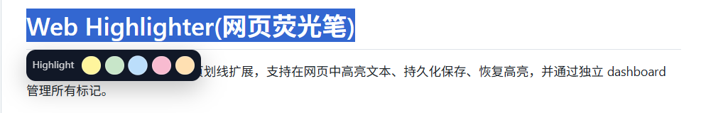
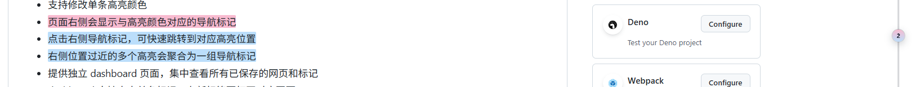

# Web Highlighter

English | [中文](./README.md)

Web Highlighter is a Chrome / Edge extension for highlighting selected text on webpages, saving highlights locally, restoring them later, and managing all saved marks from a standalone dashboard.

## Features

- Select text on any webpage and quickly highlight it with a floating toolbar
- Supports 5 preset highlight colors
- Supports custom colors from the highlight action menu
- Persists highlight data in the extension-side IndexedDB
- Restores highlights after refreshing or reopening a page
- Supports multi-line and cross-paragraph highlights while minimizing disruption to the original page structure
- Optimizes highlight rendering around line breaks to reduce visual fragments and layout disruption
- Supports regular DOM text and some Shadow DOM text
- Opens an action menu when clicking existing highlighted text
- Supports deleting individual highlights
- Supports changing the color of individual highlights
- Displays color-matched navigation markers on the right side of pages with highlights
- Clicking a right-side navigation marker jumps to the corresponding highlight
- Hovering over a right-side navigation marker previews the highlighted text; long text is truncated with an ellipsis
- Groups nearby right-side markers when multiple highlights are close together

- Provides a standalone dashboard for viewing all saved webpages and highlights
- Supports opening the original webpage by clicking a highlight record in the dashboard
- Supports deleting individual highlights and clearing all highlights from a page in the dashboard
- Supports multi-field filtering by title, URL, highlighted text, color, and date
- Supports exporting highlight data as a JSON backup file from the dashboard
- Supports importing a JSON backup file for migration across browsers, computers, or platforms
- Merges imported backup data with existing data and deduplicates by highlight ID
- Content pages and the dashboard share the same extension-side storage, so dashboard data can refresh after creating, deleting, or recoloring highlights

## Compatibility Notes

- The current version is primarily designed for article pages, news pages, long-form text pages, and some dynamic websites
- For single-page applications such as Bilibili, route-change handling and delayed restoration have been added
- For video pages, comment areas, and other dynamically rendered regions, compatibility handling has been added for comment text selection and restoration
- Highlight restoration depends on the page text and structure remaining sufficiently close to their original state
- If page content changes significantly, titles are replaced by the platform, or the site performs heavy rerendering, some highlights may still fail to restore precisely

## Storage

- The extension's main runtime storage is its own IndexedDB database named `webHighlighterDB`
- The physical IndexedDB path is managed by the browser profile, and users normally should not read, write, or move that directory directly
- To choose a backup location manually, use “Export Data” in the dashboard to generate a JSON backup file
- When switching computers, browsers, or platforms, use “Import Data” in the new environment to merge data from a backup file
- The dashboard and content pages access the same IndexedDB data through the background script

## Project Structure

- `manifest.json`: extension configuration
- `background.js`: extension background script that opens the dashboard and proxies storage requests
- `storage.js`: IndexedDB storage layer, legacy data migration, backup export, and backup import logic
- `content.js`: webpage highlighting, restoration, dynamic page monitoring, and page interaction logic
- `dashboard.html` / `dashboard.js` / `dashboard.css`: standalone management page
- `icons/`: extension icon assets for the browser toolbar, extension list, and store package

## Installation

1. Open Chrome or Edge
2. Go to `chrome://extensions` or `edge://extensions`
3. Enable “Developer mode”
4. Select “Load unpacked”
5. Choose this project directory

## Usage

1. Select a piece of text on a webpage
2. Choose a color from the floating toolbar
3. The highlight is saved immediately
4. Click highlighted text to delete it or change its color
5. Use the right-side navigation markers to preview highlight content on hover or jump to a highlight on click
6. Click the extension icon to open the dashboard and view all records
7. Filter dashboard records by title, URL, highlighted text, color, or date
8. Click a dashboard highlight record to open the original webpage in a new tab
9. Click “Export Data” at the top of the dashboard to save a JSON backup file
10. Click “Import Data” at the top of the dashboard to choose and merge a JSON backup file

## Known Limitations

- Highlight restoration is not DOM snapshot restoration; it relocates highlights based on text content, offsets, and context
- When website content changes significantly, old highlights may not restore to their original positions
- Highly dynamic websites may still show delayed restoration, which is usually corrected during later retries
- Compatibility in complex dynamic areas such as comment sections may still vary depending on the site's implementation
- Right-side navigation markers are grouped in dense highlight areas instead of being expanded one by one
- Browser extensions cannot continuously read from or write to arbitrary user-selected paths like desktop applications; cross-platform migration is handled through JSON export and import

## Maintenance

- When features, interactions, storage behavior, or compatibility behavior change, both README files should be updated
